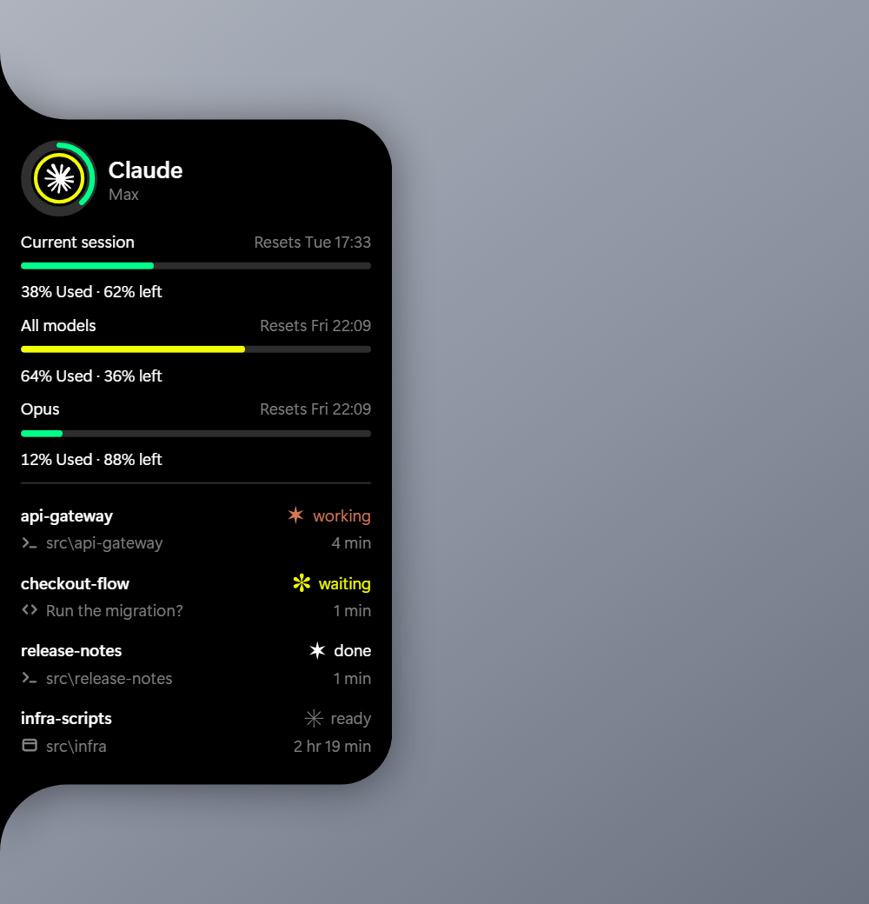
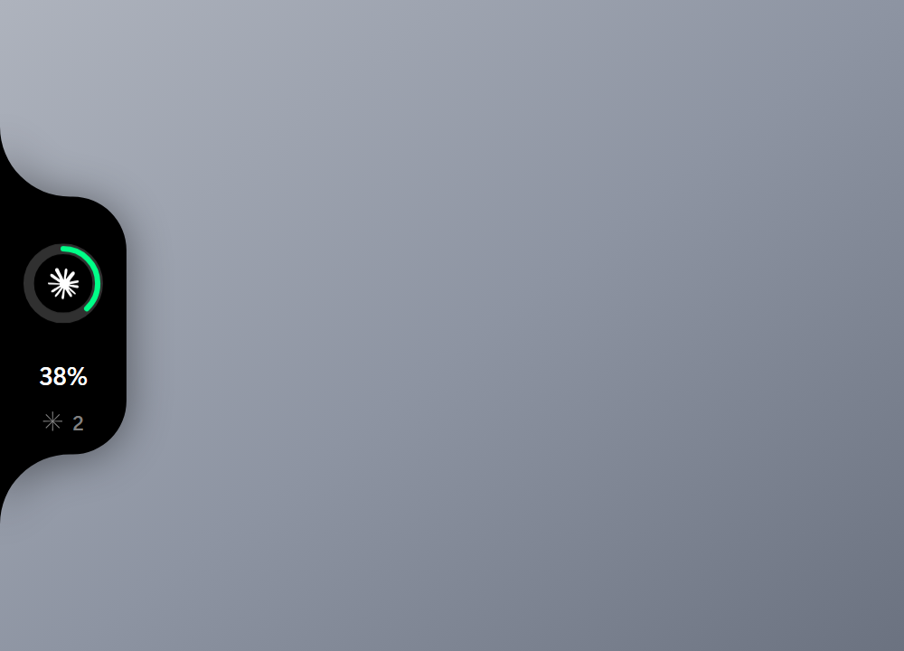
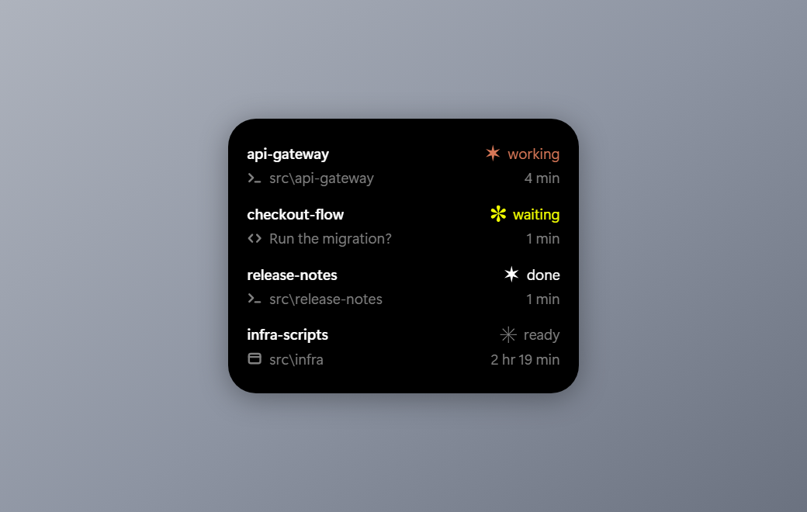

<h1 align="center">Nook</h1>

<p align="center">
  Claude usage and live Claude Code sessions, on the edge of your screen.
</p>

<p align="center">
  <a href="https://github.com/KonBuku/nook/actions/workflows/ci.yml"></a>
  <a href="https://github.com/KonBuku/nook/releases"></a>
  <a href="LICENSE"></a>
  
  <a href="https://github.com/KonBuku/nook/stargazers"></a>
</p>

<p align="center">
  
</p>

Nook pins a small black notch to the left edge of your screen. Closed, it is a
ring and a number: how much of your Claude limit is gone. Reach for it and it
unfolds into every limit window and every live Claude Code session by name.
Click a session and its terminal comes to the front.

It takes no focus, and everywhere the notch is not, the window is genuinely not
there — clicks pass straight through to whatever is behind it.

**Windows 10 and 11.** It reads the credential Claude Code already saved, so
there is nothing to sign in to: run `claude` once and the ring fills in.

<table>
<tr>
<td width="50%"></td>
<td width="50%"></td>
</tr>
<tr>
<td>At rest — the reading, and a count of what is running.</td>
<td>Open — every session, and what it is doing.</td>
</tr>
</table>

## What the ring says

The ring is your current session window, the same one Claude Code's `/usage`
leads with, so the two never disagree. Green under half, yellow past 50%, orange
past 70%. A thin arc spins *inside* it while a session is working, and it
becomes a pulsing amber ring when one is blocked waiting on you.

Each session says what it is doing in Claude Code's own marks — the six glyphs
the CLI cycles through, lifted as vector outlines from the font Windows
Terminal renders them with:

| | | |
|---|---|---|
| **working** | Claude's own terracotta | The spinner, playing. Something is happening right now. |
| **waiting** | amber | Held still, breathing. Blocked on you — and the row says what it wants instead of where it lives. |
| **done** | white | It just finished. For half a minute, so a turn ending is something you can catch. |
| **ready** | grey | Finished a while ago, still running, still yours to type into. |

Only **working** animates. Waiting breathes without moving, and the two finished
states hold a single frame: something that moves means something is happening.
Sessions that want something come first, so what scrolls off the bottom is what
matters least.

Clicking a session brings its terminal to the front — Windows Terminal, VS
Code, a bare console, whatever it is running in. A session with no window to
raise says so and does not pretend to be a button.

## Install

Download the installer from the [releases page](../../releases) and run it. It
installs for the current user only, so it needs no administrator prompt.

Or build it:

```sh
pnpm install
pnpm start     # a development build, with the webview's devtools available
pnpm release   # an installer, in src-tauri/target/release/bundle/
```

You need [Node](https://nodejs.org) 20+, [pnpm](https://pnpm.io) and a
[Rust](https://rustup.rs) toolchain. WebView2 ships with Windows 11 and with
every up-to-date Windows 10.

**On the typeface.** The design frame this is drawn from is set in SF Pro, which
Windows does not have. Nook asks for [Inter](https://rsms.me/inter/) first and
falls back to Segoe UI Variable, which every Windows 11 machine already has.
Installing Inter gets you the frame's exact texture; not installing it costs you
nothing but a slightly different `g`.

## Settings

Right-click the tray icon and choose **Edit settings…**, or open
`%APPDATA%\Nook\settings.json` yourself. It is read at launch and takes effect
on the next one. A value out of range is clamped rather than rejected — a typo
in a hand-edited file should not be what stops the app starting.

```jsonc
{
  // How far down the working area the notch's centre sits, 0 to 1.
  "anchorFraction": 0.72,
  // "ring" keeps the reading showing; "pill" folds to a slim handle until you
  // reach for it — see below.
  "restingStyle": "ring",
  "autostart": false,
  // Empty disables it. Any chord Tauri's global-shortcut plugin understands.
  "hotkey": "CommandOrControl+Alt+N",
  // Seconds between usage polls, while something is running and while nothing
  // is. Clamped to a floor the endpoint can live with.
  "activePollSeconds": 60,
  "idlePollSeconds": 300
}
```


`"restingStyle": "pill"` folds the notch away to that handle. It still opens
into the same panel — it just stops showing you a number you did not ask for.

## Documentation

- [**How it works**](docs/how-it-works.md) — what it reads, how the window is
  only where the notch is, why one number sets every size.
- [**The honest caveats**](docs/caveats.md) — the endpoint is not a published
  API, how rate limits are handled, and how a session's terminal is found.
- [**The design frame**](docs/design/README.md) — what every measurement is
  quoted from, and what was changed on purpose.
- [**Contributing**](CONTRIBUTING.md).

## Credits

Nook is a Windows port of **[Codenotch](https://github.com/vinzdg/codenotch)**
by [vinzdg](https://github.com/vinzdg) — the macOS app this is modelled on, and
where the whole idea and the entire look came from. Codenotch covers Claude
Code, Cursor, Codex and Antigravity; Nook covers Claude alone, on a platform
that has no notch of its own to borrow.

Every proportion here is measured off Codenotch's design frames. They are not
copied into this repository — they are someone else's artwork, and a port does
not need to carry them to be checked against them — so
[`docs/design`](docs/design/README.md) states which frames, and quotes every
measurement in their pixels. Codenotch is MIT-licensed, and it is worth your
star if you are on a Mac.

The session marks are Claude Code's own spinner glyphs, extracted from Segoe UI
Symbol by [`scripts/extract-spinner.mjs`](scripts/extract-spinner.mjs) rather
than redrawn.

The screenshots above are generated from the real components against invented
data — see [`scripts/shots`](scripts/shots/README.md).

## Licence

[MIT](LICENSE). Claude and Claude Code are Anthropic's; Nook is not affiliated
with Anthropic.
